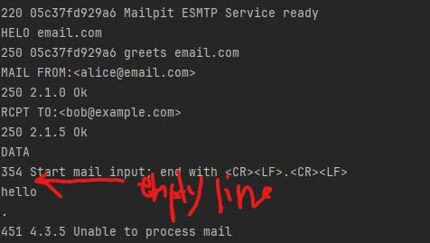
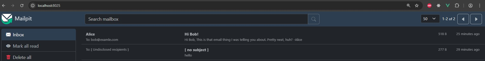

# MailDemo
## Mailpit and Docker
More info on [Mailpit](https://mailpit.axllent.org/docs/install/docker/)
* Run docker

## Testing using Telnet
* Switch on Telnep on Windows (Control Panel -> Programs and Features)
* Run commands PowerShell:
```
telnet localhost 1025
```



**Note**: There is an issue on this picture, it is supposed to be an empty line for headers before hello, otherwise sending an email command fails

## Received email
Go to http://localhost:8025/ to see emails in an inbox:

* that we sent using telnet commands
* our console app sent it with the first run
